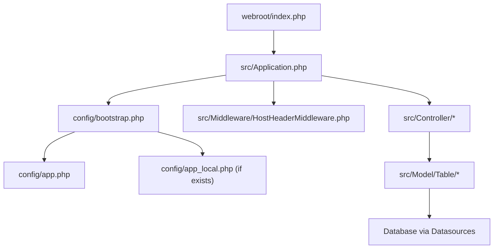
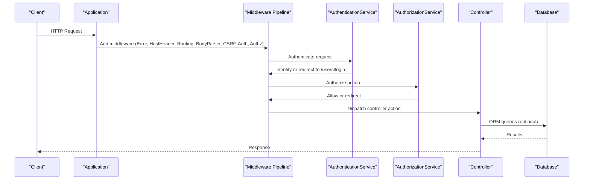
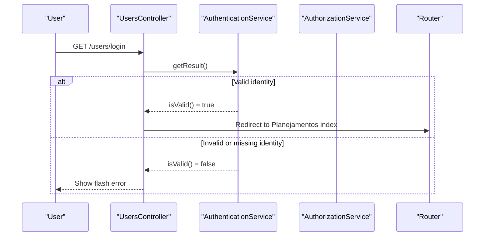
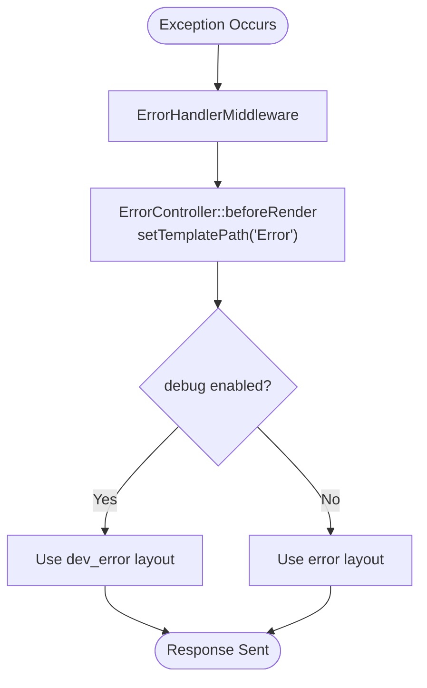
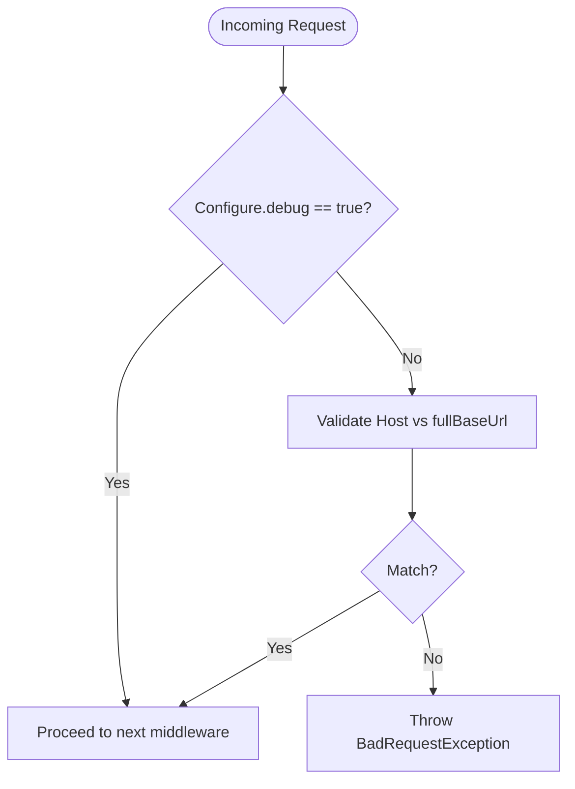
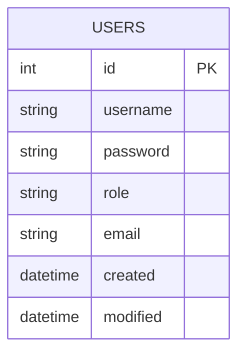
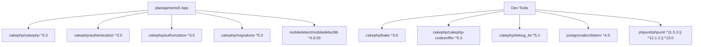

# Troubleshooting & FAQ

<cite>
**Referenced Files in This Document**
- [README.md](file://README.md)
- [composer.json](file://composer.json)
- [config/app.php](file://config/app.php)
- [config/app_local.example.php](file://config/app_local.example.php)
- [config/bootstrap.php](file://config/bootstrap.php)
- [src/Application.php](file://src/Application.php)
- [src/Middleware/HostHeaderMiddleware.php](file://src/Middleware/HostHeaderMiddleware.php)
- [src/Controller/ErrorController.php](file://src/Controller/ErrorController.php)
- [templates/Error/error400.php](file://templates/Error/error400.php)
- [templates/Error/error500.php](file://templates/Error/error500.php)
- [bin/cake.php](file://bin/cake.php)
- [src/Controller/UsersController.php](file://src/Controller/UsersController.php)
- [src/Model/Table/UsuarioplanejamentosTable.php](file://src/Model/Table/UsuarioplanejamentosTable.php)
- [config/Migrations/20260612021814_CreateUsers.php](file://config/Migrations/20260612021814_CreateUsers.php)
</cite>

## Table of Contents
1. Introduction
2. Project Structure
3. Core Components
4. Architecture Overview
5. Detailed Component Analysis
6. Dependency Analysis
7. Performance Considerations
8. Troubleshooting Guide
9. Conclusion
10. Appendices

## Introduction
This document provides comprehensive troubleshooting and frequently asked questions for the planejamento5 academic planning system. It focuses on installation issues (database connectivity, permissions, dependencies), runtime error diagnosis, log analysis, debugging techniques, performance tuning, and operational guidance for configuration, user management, scheduling conflicts, and feature limitations. It also includes step-by-step diagnostics, error code explanations, recovery procedures, known issues, workarounds, upgrade considerations, and community resources.

## Project Structure
The application is a CakePHP 5.x project with:
- Configuration files under config/
- Application bootstrap and middleware in src/
- Controllers, Models, Views, and Policies under src/ and templates/
- Database migrations under config/Migrations/
- CLI entry point bin/cake.php
- Web entry points under webroot/

**Diagram sources**
- [src/Application.php:73-122](file://src/Application.php#L73-L122)
- [config/bootstrap.php:87-100](file://config/bootstrap.php#L87-L100)
- [config/app.php:277-343](file://config/app.php#L277-L343)

**Section sources**
- [README.md:11-35](file://README.md#L11-L35)
- [composer.json:1-22](file://composer.json#L1-L22)

## Core Components
- Application bootstrap and middleware pipeline: initializes error handling, host header validation, routing, CSRF protection, authentication, and authorization.
- Authentication and authorization: configured to use session and form authenticators with password-based login against the Usuarioplanejamentos table.
- Logging: debug, error, and query logs are configured; query logging requires enabling datasource logging.
- Database connections: default MySQL connection settings and per-environment overrides via app_local.php.

Key areas to review during troubleshooting:
- Error and exception handling configuration
- Host header validation behavior in production
- Authentication flow and redirect behavior
- Logging scopes and file locations
- Datasource configuration and flags

**Section sources**
- [src/Application.php:73-122](file://src/Application.php#L73-L122)
- [src/Application.php:124-155](file://src/Application.php#L124-L155)
- [config/app.php:176-183](file://config/app.php#L176-L183)
- [config/app.php:348-373](file://config/app.php#L348-L373)
- [config/app.php:277-343](file://config/app.php#L277-L343)

## Architecture Overview
Request lifecycle overview with middleware and authentication:

**Diagram sources**
- [src/Application.php:73-122](file://src/Application.php#L73-L122)
- [src/Application.php:124-155](file://src/Application.php#L124-L155)

## Detailed Component Analysis

### Authentication and Authorization Flow
- The application uses session and form authenticators. Login redirects unauthenticated users to /users/login.
- Unauthorized actions are redirected to /users/login with a redirect query parameter.
- The user model is Usuarioplanejamentos, mapped to the users table.

**Diagram sources**
- [src/Controller/UsersController.php:29-50](file://src/Controller/UsersController.php#L29-L50)
- [src/Application.php:124-155](file://src/Application.php#L124-L155)

**Section sources**
- [src/Controller/UsersController.php:13-77](file://src/Controller/UsersController.php#L13-L77)
- [src/Application.php:124-155](file://src/Application.php#L124-L155)

### Error Handling and Templates
- ErrorController sets template path to Error views.
- 404 and 500 templates render messages and, in debug mode, developer-friendly details.

**Diagram sources**
- [src/Controller/ErrorController.php:54-59](file://src/Controller/ErrorController.php#L54-L59)
- [templates/Error/error400.php:11-20](file://templates/Error/error400.php#L11-L20)
- [templates/Error/error500.php:12-30](file://templates/Error/error500.php#L12-L30)

**Section sources**
- [src/Controller/ErrorController.php:33-59](file://src/Controller/ErrorController.php#L33-L59)
- [templates/Error/error400.php:1-27](file://templates/Error/error400.php#L1-L27)
- [templates/Error/error500.php:1-37](file://templates/Error/error500.php#L1-L37)

### Host Header Validation
- In production, HostHeaderMiddleware enforces App.fullBaseUrl and rejects mismatched Host headers to prevent injection attacks.
- In development (debug=true), it bypasses validation.

**Diagram sources**
- [src/Middleware/HostHeaderMiddleware.php:32-36](file://src/Middleware/HostHeaderMiddleware.php#L32-L36)
- [config/bootstrap.php:152-183](file://config/bootstrap.php#L152-L183)

**Section sources**
- [src/Middleware/HostHeaderMiddleware.php:1-36](file://src/Middleware/HostHeaderMiddleware.php#L1-L36)
- [config/bootstrap.php:152-183](file://config/bootstrap.php#L152-L183)

### Database Connections and Migrations
- Default MySQL connection is configured; environment-specific values are set in app_local.php.
- Users table migration defines fields and timestamps.

**Diagram sources**
- [config/Migrations/20260612021814_CreateUsers.php:16-48](file://config/Migrations/20260612021814_CreateUsers.php#L16-L48)

**Section sources**
- [config/app.php:277-343](file://config/app.php#L277-L343)
- [config/app_local.example.php:40-78](file://config/app_local.example.php#L40-L78)
- [config/Migrations/20260612021814_CreateUsers.php:16-48](file://config/Migrations/20260612021814_CreateUsers.php#L16-L48)

## Dependency Analysis
Core runtime dependencies include CakePHP framework, authentication and authorization plugins, migrations, and mobile detection library. Development dependencies include bake, codesniffer, debug kit, dotenv, and PHPUnit.

**Diagram sources**
- [composer.json:7-22](file://composer.json#L7-L22)

**Section sources**
- [composer.json:1-60](file://composer.json#L1-L60)

## Performance Considerations
- Enable query logging only when diagnosing slow queries; keep it disabled in production due to overhead.
- Use database indexes appropriately for frequent filters (e.g., scheduling tables).
- Avoid quoteIdentifiers unless necessary; it adds traversal overhead.
- Ensure cache directories are writable and consider using persistent caches for translations and models in production.
- Monitor memory usage if increasing DebugKit maxDepth; high depth can cause out-of-memory errors.

[No sources needed since this section provides general guidance]

## Troubleshooting Guide

### Installation Issues

#### Composer and PHP Version
- Symptom: composer install fails due to PHP version incompatibility.
- Resolution: Ensure PHP >= 8.2 as required by the project.

**Section sources**
- [composer.json:7-15](file://composer.json#L7-L15)

#### Missing Dependencies
- Symptom: Class not found or plugin not loaded.
- Resolution: Run composer install/update; ensure allow-plugins is configured as in composer.json.

**Section sources**
- [composer.json:40-47](file://composer.json#L40-L47)

#### Database Connection Problems
- Symptoms:
  - “Connection refused” or “Access denied”
  - Character set errors
- Resolutions:
  - Verify host, port, username, password, database in app_local.php.
  - For MySQL servers with skip-character-set-client-handshake, set flags to initialize charset.
  - Confirm utf8mb4 encoding is supported by your MySQL/MariaDB server.

**Section sources**
- [config/app_local.example.php:40-78](file://config/app_local.example.php#L40-L78)
- [config/app.php:294-306](file://config/app.php#L294-L306)

#### Permission Errors
- Symptoms:
  - Cannot write to cache/logs/tmp directories
  - CLI and web processes conflict over log files
- Resolutions:
  - Ensure web server user has write access to cache, logs, and tmp directories.
  - In CLI environments, separate log files are used to avoid permission conflicts.

**Section sources**
- [config/bootstrap.php:136-148](file://config/bootstrap.php#L136-L148)

#### Host Header Injection Protection
- Symptom: Requests rejected in production with bad host header.
- Resolution: Set APP_FULL_BASE_URL or App.fullBaseUrl to the correct base URL.

**Section sources**
- [config/bootstrap.php:152-183](file://config/bootstrap.php#L152-L183)
- [src/Middleware/HostHeaderMiddleware.php:32-36](file://src/Middleware/HostHeaderMiddleware.php#L32-L36)

### Runtime Error Diagnosis

#### Enabling Debug Mode
- Symptom: No detailed errors shown in browser.
- Resolution: Set debug=true in app_local.php for development.

**Section sources**
- [config/app_local.example.php:21](file://config/app_local.example.php#L21)

#### Error Pages and Developer View
- Symptom: Generic error pages without stack traces.
- Resolution: In debug mode, error templates switch to dev_error layout and show file/line links.

**Section sources**
- [templates/Error/error400.php:11-20](file://templates/Error/error400.php#L11-L20)
- [templates/Error/error500.php:12-30](file://templates/Error/error500.php#L12-L30)

#### Authentication Failures
- Symptom: Login always fails or redirects unexpectedly.
- Resolutions:
  - Verify credentials and that the users table exists and contains hashed passwords.
  - Ensure the user model mapping is correct (Usuarioplanejamentos -> users).
  - Check unauthenticatedRedirect and loginUrl configurations.

**Section sources**
- [src/Controller/UsersController.php:29-50](file://src/Controller/UsersController.php#L29-L50)
- [src/Application.php:124-155](file://src/Application.php#L124-L155)
- [src/Model/Table/UsuarioplanejamentosTable.php:11-22](file://src/Model/Table/UsuarioplanejamentosTable.php#L11-L22)

#### Authorization Redirects
- Symptom: Accessing protected routes redirects to login.
- Resolution: Review policy implementations and ensure identity is present.

**Section sources**
- [src/Application.php:107-119](file://src/Application.php#L107-L119)

### Log File Analysis

#### Locating Logs
- Debug and error logs are written to LOGS directory with filenames debug and error.
- Query logs are available under a dedicated scope when datasource logging is enabled.

**Section sources**
- [config/app.php:348-373](file://config/app.php#L348-L373)

#### Enabling Query Logging
- Symptom: Need to identify slow queries.
- Resolution: Enable datasource logging flag; query logs will be written to the queries file.

**Section sources**
- [config/app.php:365-373](file://config/app.php#L365-L373)

#### CLI vs Web Log Separation
- Symptom: Permission conflicts between CLI and web processes writing to same log files.
- Resolution: CLI uses separate log files (cli-debug, cli-error) to avoid conflicts.

**Section sources**
- [config/bootstrap.php:136-148](file://config/bootstrap.php#L136-L148)

### Debugging Techniques

#### Using the CLI Runner
- Symptom: Commands not recognized or failing.
- Resolution: Use bin/cake.php to run commands within the application context.

**Section sources**
- [bin/cake.php:1-11](file://bin/cake.php#L1-L11)

#### DebugKit Usage
- Symptom: Want to inspect requests, queries, and variables.
- Resolution: Install and enable cakephp/debug_kit; adjust maxDepth carefully to avoid memory issues.

**Section sources**
- [composer.json:16-22](file://composer.json#L16-L22)
- [config/app.php:446-450](file://config/app.php#L446-L450)

### Performance Troubleshooting

#### Slow Query Identification
- Steps:
  - Enable query logging in datasource configuration.
  - Reproduce the issue and analyze the queries log file.
  - Optimize queries or add appropriate database indexes.

**Section sources**
- [config/app.php:365-373](file://config/app.php#L365-L373)

#### Memory Usage Optimization
- Symptom: Out-of-memory errors with deep debug output.
- Resolution: Reduce DebugKit maxDepth and variablesPanelMaxDepth; disable unnecessary panels.

**Section sources**
- [config/app.php:446-450](file://config/app.php#L446-L450)

#### Bottleneck Resolution
- Recommendations:
  - Disable quoteIdentifiers unless required.
  - Ensure proper caching of translations and models in production.
  - Tune database settings (e.g., innodb_stats_on_metadata) as documented.

**Section sources**
- [config/app.php:308-326](file://config/app.php#L308-L326)

### Recovery Procedures for Critical Failures

#### Database Unavailable
- Steps:
  - Verify Datasources.default configuration in app_local.php.
  - Check network connectivity and credentials.
  - Restart services after correcting configuration.

**Section sources**
- [config/app_local.example.php:40-78](file://config/app_local.example.php#L40-L78)

#### Host Header Rejection in Production
- Steps:
  - Set APP_FULL_BASE_URL or App.fullBaseUrl to the correct domain.
  - Restart the web server or PHP-FPM process.

**Section sources**
- [config/bootstrap.php:152-183](file://config/bootstrap.php#L152-L183)

#### Authentication Loop
- Steps:
  - Confirm users table schema and presence of hashed passwords.
  - Verify UserModel mapping and field names.
  - Clear sessions if corrupted.

**Section sources**
- [src/Model/Table/UsuarioplanejamentosTable.php:11-22](file://src/Model/Table/UsuarioplanejamentosTable.php#L11-L22)
- [src/Application.php:124-155](file://src/Application.php#L124-L155)

### Known Issues and Workarounds

- Host Header Injection protection may block requests if fullBaseUrl is not set in production.
  - Workaround: Configure APP_FULL_BASE_URL or App.fullBaseUrl.
- Character set issues with older MySQL setups.
  - Workaround: Use flags to set charset initialization command.
- CLI and web log file conflicts.
  - Workaround: Rely on CLI-specific log files automatically configured in bootstrap.

**Section sources**
- [config/bootstrap.php:152-183](file://config/bootstrap.php#L152-L183)
- [config/app.php:294-306](file://config/app.php#L294-L306)
- [config/bootstrap.php:136-148](file://config/bootstrap.php#L136-L148)

### Upgrade Considerations

- PHP version must be >= 8.2.
- Keep dependencies updated via composer; review breaking changes in CakePHP 5.x and plugins.
- After upgrades, clear caches and re-run migrations if schema changes are included.

**Section sources**
- [composer.json:7-15](file://composer.json#L7-L15)
- [README.md:42-46](file://README.md#L42-L46)

### Frequently Asked Questions

#### System Configuration
- Q: How do I configure the database?
  - A: Edit app_local.php with host, port, username, password, database, and optional url.
- Q: How do I set the base URL for production?
  - A: Set APP_FULL_BASE_URL or App.fullBaseUrl to the correct domain.

**Section sources**
- [config/app_local.example.php:40-78](file://config/app_local.example.php#L40-L78)
- [config/bootstrap.php:152-183](file://config/bootstrap.php#L152-L183)

#### User Management
- Q: Where are users stored?
  - A: In the users table, mapped by UsuarioplanejamentosTable.
- Q: Why does login fail even with correct credentials?
  - A: Ensure passwords are hashed correctly and the user model mapping is accurate.

**Section sources**
- [src/Model/Table/UsuarioplanejamentosTable.php:11-22](file://src/Model/Table/UsuarioplanejamentosTable.php#L11-L22)
- [src/Controller/UsersController.php:29-50](file://src/Controller/UsersController.php#L29-L50)

#### Scheduling Conflicts
- Q: How do I detect and resolve scheduling conflicts?
  - A: Implement validation rules in relevant Table classes and policies to enforce constraints; use query logs to diagnose performance issues during conflict checks.

[No sources needed since this section doesn't analyze specific files]

#### Feature Limitations
- Q: Can I disable Host header validation?
  - A: Only in debug mode; in production, it is enforced to prevent security risks.

**Section sources**
- [src/Middleware/HostHeaderMiddleware.php:32-36](file://src/Middleware/HostHeaderMiddleware.php#L32-L36)

### Step-by-Step Diagnostic Procedures

- Database Connectivity Test:
  - Verify app_local.php Datasources.default entries.
  - Attempt a simple ORM query from a controller or shell command.
  - Inspect error logs for connection failures.

- Authentication Flow Test:
  - Access /users/login and attempt login.
  - Check Flash messages and redirects.
  - Review logs for authentication exceptions.

- Host Header Validation Test:
  - In production, send requests with mismatched Host headers.
  - Expect rejection; set fullBaseUrl to allow requests.

- Query Performance Test:
  - Enable datasource logging.
  - Reproduce the operation and analyze queries.log.

**Section sources**
- [config/app_local.example.php:40-78](file://config/app_local.example.php#L40-L78)
- [config/app.php:365-373](file://config/app.php#L365-L373)
- [src/Middleware/HostHeaderMiddleware.php:32-36](file://src/Middleware/HostHeaderMiddleware.php#L32-L36)

### Error Code Explanations

- 404 Not Found:
  - Indicates requested address not found; check routes and controller actions.
- 500 Internal Server Error:
  - General server error; review error logs and stack traces in debug mode.

**Section sources**
- [templates/Error/error400.php:22-26](file://templates/Error/error400.php#L22-L26)
- [templates/Error/error500.php:32-36](file://templates/Error/error500.php#L32-L36)

### Community Resources and Support

- Official documentation and examples are referenced in README.md.
- For bug reports and feature requests, follow repository contribution guidelines and templates.

**Section sources**
- [README.md:1-10](file://README.md#L1-L10)

## Conclusion
This guide consolidates common installation pitfalls, runtime diagnostics, logging strategies, performance tuning, and operational FAQs for the planejamento5 system. By following the step-by-step procedures and referencing the provided configuration and source files, administrators and developers can quickly identify and resolve issues, maintain secure and performant deployments, and contribute effectively to the project.

## Appendices

### Quick Reference: Key Configuration Keys
- Datasources.default.host, port, username, password, database, url
- Security.salt
- App.fullBaseUrl
- Error.errorLevel, trace, log
- Log.debug.file, Log.error.file, Log.queries.file
- Session.defaults

**Section sources**
- [config/app.php:277-343](file://config/app.php#L277-L343)
- [config/app.php:176-183](file://config/app.php#L176-L183)
- [config/app.php:348-373](file://config/app.php#L348-L373)
- [config/app.php:419-421](file://config/app.php#L419-L421)